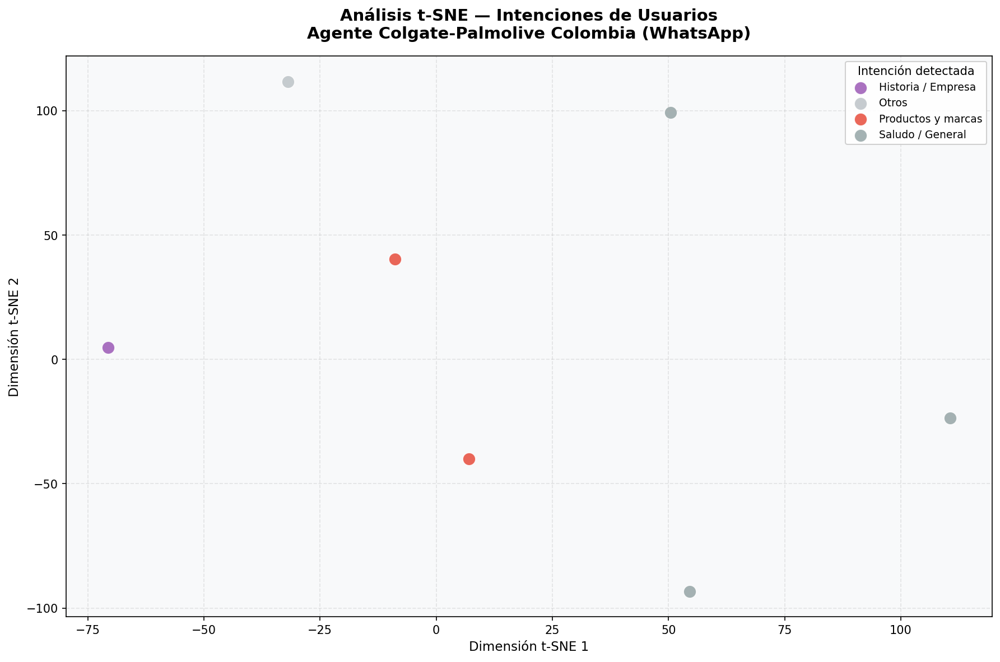

# Agente Conversacional Corporativo — Colgate-Palmolive Colombia

**Módulo 3 · Ruta B: Sistema Operativo Agéntico (OpenFang 0.6.9)**

| Campo | Detalle |
|---|---|
| Institución | Universidad Autónoma de Occidente |
| Asignatura | Técnicas de Inteligencia Artificial |
| Autores | Jorge Castaño López |
| | Natalia Arias Londoño |
| | Jorge Mario Gallego Uribe |
| | Jhonathan Leandro Clavijo Troches |
| Fecha | 5 de junio de 2026 |
| Repositorio | https://github.com/jorgegallegou/colgatefinal |

---

## 1. Introducción

Este informe documenta el diseño, implementación y validación en producción de un agente conversacional corporativo para Colgate-Palmolive Colombia, desarrollado como entregable del Módulo 3 del curso de Técnicas de Inteligencia Artificial.

El proyecto se ejecuta bajo la **Ruta B: Sistema Operativo Agéntico**, que exige desplegar el agente sobre OpenFang 0.6.9 — un kernel especializado para agentes de IA escrito en Rust. El sistema resultante es un bot de WhatsApp disponible las 24 horas que responde consultas de consumidores con conocimiento real de la empresa y ejecuta vigilancia competitiva autónoma en segundo plano.

---

## 2. Contexto y Justificación

Colgate-Palmolive Colombia atiende consultas a través de su línea gratuita **018000520800**, operativa de lunes a viernes entre las 8:00 AM y las 6:00 PM. Fuera de ese horario no existe ningún canal digital automatizado disponible para el consumidor.

Las consultas más frecuentes que el agente resuelve son:

- Localización de puntos de venta por ciudad
- Composición e información nutricional de productos
- Historia, valores y estructura corporativa
- Datos de contacto, sedes y horarios de atención

El agente ofrece cobertura continua sin intervención humana, con respuestas fundamentadas en información oficial verificada.

---

## 3. Módulo 1 — Recolección de Datos (Web Scraping)

### 3.1 Objetivo

Construir una base de conocimiento con información oficial y verificada de Colgate-Palmolive Colombia que sirviera como fuente de verdad para el agente conversacional de los módulos siguientes.

### 3.2 Herramientas utilizadas

| Herramienta | Versión | Propósito |
|---|---|---|
| Selenium + ChromeDriver | 4.x | Navegación y renderizado de páginas con JavaScript |
| BeautifulSoup 4 | 4.x | Parsing y extracción de elementos HTML |
| trafilatura | 1.x | Extracción de texto principal eliminando navegación y publicidad |
| yt-dlp | — | Descarga de transcripciones automáticas de YouTube |
| requests | 2.x | Peticiones HTTP para páginas estáticas |

### 3.3 Fuentes de datos

Se scrapearon **24 URLs** del sitio oficial de Colgate-Palmolive Colombia y fuentes externas verificadas:

| Categoría | Fuentes | Ejemplos |
|---|---|---|
| Sitio oficial Colombia | 16 páginas | Quiénes somos, fundación, políticas, sostenibilidad, contacto |
| Fuentes externas | 8 fuentes | Valora Analitik, El País, La República, Portafolio, Mapa Social |
| Wikipedia | 1 artículo | Colgate-Palmolive (historia global, cifras, subsidiarias) |
| YouTube oficial | 8 videos | Transcripciones del canal corporativo colombiano |

### 3.4 Pipeline de procesamiento

```
Scraping (Selenium + BS4 + trafilatura)
          │
          ▼  JSON raw por fuente
paginas_raw.json · wikipedia_raw.json · youtube_raw.json
          │
          ▼  clean_text()
          Normalización: espacios múltiples, caracteres invisibles,
          saltos de línea excesivos, caracteres fuera de rango
          │
          ▼  chunk_text(max_chars=1500, overlap=150)
          División en fragmentos cortando en límites de oración,
          con solapamiento de 150 caracteres para preservar contexto
          │
          ▼
knowledge_base_clean.txt  (~235 fragmentos · ~80 000 caracteres)
```

### 3.5 Resultado

| Fuente | Fragmentos |
|---|---|
| Sitio oficial Colgate Colombia | ~95 |
| Wikipedia — Colgate-Palmolive | ~45 |
| Canal YouTube oficial | ~95 |
| **Total** | **~235 fragmentos** |

---

## 4. Módulo 2 — Prototipo Conversacional (Gradio + LangChain)

### 4.1 Arquitectura

El Módulo 2 implementó un prototipo de agente conversacional con interfaz web usando **Gradio** y **LangChain** como orquestador del LLM.

```
Usuario (navegador web)
      │
      ▼  HTTP local
┌─────────────────────────────────────────┐
│  Gradio Interface                       │
│  localhost · Puerto 7860                │
│                                         │
│  ├─ Tab "Resumen"   Resumen ejecutivo   │
│  ├─ Tab "FAQ"       10 preguntas fijas  │
│  └─ Tab "Q&A"       Chat libre          │
└──────────────────┬──────────────────────┘
                   │  LangChain invoke()
                   ▼
┌─────────────────────────────────────────┐
│  LangChain + ChatMistralAI              │
│  mistral-small-latest · temp 0.3        │
│                                         │
│  System prompt = rol + instrucciones    │
│                + KB completo (~80K)     │
│  Context window: historial últimos 8    │
└─────────────────────────────────────────┘
```

### 4.2 Mecanismo de memoria

En el Módulo 2 no existe vector store ni recuperación semántica. Los ~80 000 caracteres de la base de conocimiento se inyectan **completos** en el system prompt en cada llamada al LLM. El historial de conversación se mantiene en memoria de la sesión de Gradio (máximo 8 turnos anteriores para no saturar el contexto).

### 4.3 Limitaciones identificadas

| Limitación | Impacto |
|---|---|
| KB completo en system prompt | Consumo elevado de tokens por consulta; riesgo de superar la ventana de contexto |
| Sesión única (sin aislamiento) | Un solo usuario a la vez; historial compartido en la misma instancia |
| Sin recuperación semántica | El modelo recibe todo el conocimiento aunque solo sea relevante una fracción |
| Interfaz web local | No accesible fuera de la red local sin túnel explícito |
| Sin autonomía | El agente solo responde cuando alguien lo consulta |

Estas limitaciones definieron los requisitos de diseño del Módulo 3.

---

## 5. Evolución Arquitectónica: Módulo 2 → Módulo 3

El Módulo 2 produjo un prototipo funcional con limitaciones estructurales para entornos multiusuario. El Módulo 3 resuelve cada una de esas limitaciones:

| Dimensión | Módulo 2 | Módulo 3 |
|---|---|---|
| Interfaz de usuario | Gradio (web local, puerto 7860) | WhatsApp (canal masivo) |
| Orquestación | LangChain + ChatMistralAI | OpenFang Agent OS (Rust) |
| Memoria | KB completo en system prompt | KV Store + Vector Store nativos |
| Usuarios simultáneos | 1 — sesión única | Ilimitados — sesión por teléfono |
| Autonomía | Reactivo al 100 % | Hands autónomos en background |
| Canal de mensajería | HTTP local | WhatsApp Web (Baileys, puerto 3009) |
| LLM | OpenAI / Ollama | Mistral Small (`mistral-small-latest`) |
| Aislamiento | Sin sandbox | WASM sandbox por agente |

El cambio más significativo es la **autonomía**: el agente del Módulo 3 no espera ser consultado — recolecta inteligencia de mercado de forma proactiva cada 6 horas.

---

## 6. Arquitectura del Sistema

### 6.1 Diagrama de componentes

```
WhatsApp User
      │
      │  WhatsApp Web Protocol (WebSocket)
      ▼
┌─────────────────────────────────────────┐
│  Baileys Gateway                        │
│  Node.js · Port 3009                    │
│  ~/.openfang/whatsapp-gateway/index.js  │
│                                         │
│  · Receives inbound messages            │
│  · Creates isolated session per phone   │
│  · Strips Markdown for WhatsApp format  │
│  · Delivers response back to user       │
└──────────────────┬──────────────────────┘
                   │
                   │  POST /api/agents/{uuid}/message?session_id={sid}
                   ▼
┌─────────────────────────────────────────┐
│  OpenFang Kernel · Rust · Port 4200     │
│                                         │
│  Agent: colgate-assistant               │
│  UUID: 4fe45ca6-d6dc-4ca6-8590-...     │
│                                         │
│  Memory                                 │
│  ├─ KV Store   — NIT, phones, offices   │
│  ├─ Vector Store — 235 fragments (RAG)  │
│  └─ JSONL sessions — one per user       │
│                                         │
│  Autonomous Hands                       │
│  ├─ colgate-intelligence-hand  (6h)     │
│  └─ colgate-service-hand  (Mon 9 AM)    │
└──────────────────┬──────────────────────┘
                   │  HTTPS
                   ▼
┌─────────────────────────────────────────┐
│  Mistral AI Cloud                       │
│  mistral-small-latest · temp 0.3        │
│  Average latency < 800 ms               │
└─────────────────────────────────────────┘
```

### 6.2 Ciclo de vida de un mensaje

1. El usuario envía un mensaje por WhatsApp.
2. El **Gateway Baileys** resuelve o crea la sesión asociada al número de teléfono.
3. Reenvía el mensaje a **OpenFang** con el `session_id` del usuario.
4. OpenFang recupera los **3 fragmentos más relevantes** del Vector Store (RAG, `top_k = 3`).
5. Construye el prompt: contexto corporativo + historial de sesión + mensaje actual.
6. Envía el prompt a **Mistral AI** y recibe la respuesta generada.
7. El Gateway convierte el formato Markdown al formato nativo de WhatsApp.
8. El mensaje llega al usuario.

---

## 7. Decisiones Técnicas

### 7.1 OpenFang vs LangChain

LangChain es una librería de orquestación. OpenFang es un sistema operativo para agentes. La diferencia determina qué debe construirse desde cero y qué está disponible nativamente:

| Capacidad | LangChain | OpenFang |
|---|---|---|
| Sesiones multi-usuario | Implementación manual | Nativo — `POST /api/agents/{id}/sessions` |
| Aislamiento de seguridad | Sin sandbox | WASM — módulo aislado por agente |
| Canal WhatsApp | Librería externa | Nativo — configuración en `hand.toml` |
| Agentes en background | No disponible | Hands — cron nativo integrado |
| Consumo de memoria | Variable | ~32 MB en reposo (kernel Rust) |

Para este proyecto, usar LangChain habría requerido implementar la lógica de sesiones, el canal WhatsApp y los jobs de background desde cero. OpenFang los provee como primitivas del sistema.

### 7.2 Mistral API vs Ollama

El curso recomienda Ollama (inferencia local) para garantizar soberanía de datos. Este proyecto optó por **Mistral API** por las siguientes razones:

| Criterio | Ollama (local) | Mistral API |
|---|---|---|
| Soberanía de datos | Total — sin salida del equipo | Parcial — empresa francesa, regulación GDPR |
| Latencia | 8–15 s (CPU) · 1–3 s (GPU) | < 800 ms garantizado |
| Disponibilidad | Depende del hardware local | 99.9 % SLA |
| Calidad en español | Aceptable (Llama 3.2 / Gemma) | Superior (entrenamiento europeo multilingüe) |

La arquitectura es agnóstica al proveedor. Migrar a Ollama requiere únicamente dos líneas en `hand.toml`:

```toml
[model]
provider = "ollama"
model    = "llama3.2"
```

OpenFang detecta la instancia de Ollama en `localhost:11434` sin ninguna otra modificación.

---

## 8. Base de Conocimiento Corporativo

### 8.1 Fuentes de datos

El conocimiento del agente fue construido en el Módulo 1 (Web Scraping) a partir de tres fuentes oficiales:

| Fuente | Contenido | Fragmentos |
|---|---|---|
| Sitio oficial Colgate Colombia | Productos, historia, sedes, contacto | ~95 |
| Wikipedia — Colgate-Palmolive | Historia global, cifras, subsidiarias | ~45 |
| Canal YouTube oficial | Transcripciones de 8 videos corporativos | ~95 |
| **Total** | | **~235 fragmentos** |

### 8.2 Almacenamiento

Se utilizan dos tipos de memoria según la naturaleza de la información:

**KV Store** — datos exactos y deterministas:

```
nit              → 890.300.546-6
linea_gratuita   → 018000520800
sede_principal   → Cra 7 # 71-52, Torre B, Bogotá
fundacion        → 1806 (Nueva York) / 1943 (Colombia)
```

**Vector Store** — conocimiento semántico para RAG:

Los 235 fragmentos se vectorizan con `mistral-embed` (1024 dimensiones). Ante cada consulta, OpenFang recupera los 3 fragmentos con mayor similitud coseno y los inyecta en el contexto del LLM.

---

## 9. Hands — Operaciones Autónomas

Los Hands son agentes en background definidos en `hand.toml` que se ejecutan según un calendario sin intervención humana.

### 9.1 Hand de inteligencia competitiva

```toml
[[hands]]
name     = "colgate-intelligence-hand"
type     = "collector"
schedule = "0 */6 * * *"
targets  = [
    "Colgate-Palmolive Colombia noticias",
    "Procter Gamble Crest Colombia",
    "Unilever Dove Colombia competencia",
    # ...
]
alert_keywords = ["crisis", "recall", "retiro", "demanda"]
store_to_memory = true
```

Cada 6 horas busca en fuentes web y de noticias información sobre Colgate Colombia y sus competidores directos (P&G, Unilever). Los hallazgos se almacenan en la memoria del agente y quedan disponibles para consultas RAG.

### 9.2 Hand de monitoreo de servicio

```toml
[[hands]]
name     = "colgate-service-hand"
type     = "custom"
schedule = "0 9 * * 1"
alert_keywords = ["queja", "reclamo", "defectuoso", "mal servicio"]
output_format  = "json_report"
```

Cada lunes a las 9:00 AM consolida opiniones de consumidores en redes sociales y genera un reporte JSON con patrones de insatisfacción.

### 9.3 Activación — evidencia de ejecución

```
$ openfang hand activate collector --name colgate-intelligence-hand
Hand 'collector' activated
  instance : a5d6fdcf-5212-45f0-bcdb-db94559d1e9d
  name     : colgate-intelligence-hand

$ openfang hand activate researcher --name colgate-service-hand
Hand 'researcher' activated
  instance : 813038f7-b23a-440e-849d-d8e34ee65a7f
  name     : colgate-service-hand
```

Estado del sistema — 5 de junio de 2026, 22:00:

```
AGENT                     STATUS    UUID
────────────────────────────────────────────────────────
colgate-assistant         Running   4fe45ca6-d6dc-4ca6-8590
colgate-intelligence-hand Running   2a658329-d5ce-5766-8d49
colgate-service-hand      Running   2dbac136-e137-5eb2-8106
```

---

## 10. Reporte de Inteligencia Autónomo

El agente `colgate-intelligence-hand` ejecutó **2 ciclos autónomos** el 5 de junio de 2026 (18:44 y 19:43), procesando 4 fuentes web por ciclo sin intervención humana. A continuación el extracto del Ciclo 2.

> **Intelligence Report** · 2026-06-05 · Ciclo 2 · Fuentes procesadas: 4

| Entidad | Tipo | Hallazgo |
|---|---|---|
| Ram Raghavan | Persona | Designado Global CMO de Colgate-Palmolive, junio 2026. Supervisa Colgate, Palmolive, Hill's, elmex, Suavitel y Fabuloso. |
| Optic White Pro Series | Producto | Lanzado en marzo 2026. 5 % H₂O₂, tecnología ActivShine. MSRP USD 9.99. Segmento blanqueamiento premium. |
| Estrategia 2030 | Iniciativa | 96 % empaques reciclables (meta 100 %), 83 % energía renovable, cero emisiones netas para 2040. |
| Bank of America / J.P. Morgan | Inversores | Reuniones programadas con Colgate-Palmolive India, junio 2026. |

*Reporte almacenado en memoria del agente — disponible para consultas en tiempo real.*

---

## 11. Validación en Producción

El sistema fue probado con **3 usuarios reales simultáneos** desde dispositivos diferentes: Natalia, Daniel Gallego y Jhonathan.

### 11.1 Conversación registrada — Jhonathan, 5 de junio de 2026

```
16:09  Jhonathan  Hola
16:09  Bot        Hola, soy el asistente virtual de Colgate-Palmolive Colombia.
                  ¿En qué puedo ayudarte?

16:10  Jhonathan  Cual es la historia de la compañia?
16:10  Bot        Colgate-Palmolive fue fundada en 1806 por William Colgate en
                  Nueva York. Llegó a Colombia en 1943, estableciéndose en
                  Cartagena. Hoy opera desde Yumbo, Valle del Cauca...

16:11  Jhonathan  Cuales son sus politicas ambientales?
16:11  Bot        *Reducción de emisiones:* cero emisiones netas para 2040.
                  *Energías renovables:* 83 % de operaciones actuales.
                  *Empaques:* 96 % reciclables, meta 100 % en 2025.

16:11  Jhonathan  Cual es el NIT?
16:11  Bot        El NIT de Colgate-Palmolive Colombia es *890.300.546-6*.
```

### 11.2 Cobertura funcional verificada

| Dominio | Consultas verificadas |
|---|---|
| Historia corporativa | Fundación 1806, llegada a Colombia 1943, planta Yumbo |
| Datos exactos | NIT, línea gratuita 018000520800, sedes |
| Portafolio | Dental care, hogar, personal care, Hill's Pet Nutrition |
| Distribución | Éxito, Carulla, D1, Jumbo en Cali |
| Sostenibilidad | Estrategia 2030, empaques reciclables, emisiones netas |

---

## 12. Incidentes de Producción y Resolución

| Incidente | Causa raíz | Solución implementada |
|---|---|---|
| Bot sin respuesta | Gateway enviaba nombre del agente; la API REST espera UUID | Función `resolveAgentId()` — `GET /api/agents` traduce nombre → UUID |
| Mensajes no entregados | JID multi-device `@lid` convertido incorrectamente a `@s.whatsapp.net` | Usar `remoteJid` original sin transformación |
| Formato ilegible en WhatsApp | LLM generaba `###`, `**bold**`, `---` que WhatsApp no renderiza | Función `toWhatsApp()` — convierte `**` → `*`, elimina `###` |
| Contaminación entre sesiones | Sesión global única + memoria diaria inyectaba contexto de otros usuarios | Sesión aislada por teléfono + instrucción explícita en system prompt |

### 12.1 Análisis del bug de contaminación de sesiones

Este fue el incidente de mayor impacto. La cadena de fallo:

1. Natalia inicia conversación → el agente registra su nombre en la memoria diaria.
2. Jhonathan inicia conversación → OpenFang inyecta el archivo de memoria del día como contexto.
3. El agente saluda: *"¡Hola Natalia!"* — aunque Jhonathan nunca se presentó.

Solución en tres capas:

- **Aislamiento de sesiones** — cada número de teléfono obtiene un `session_id` único vía `POST /api/agents/{id}/sessions`.
- **Memoria limpia** — eliminación del archivo `2026-06-05.md` que contenía el nombre contaminante.
- **System prompt defensivo** — instrucción explícita: *"IGNORA cualquier nombre del contexto de memoria diaria. NUNCA uses un nombre en el saludo inicial."*

---

## 13. Análisis t-SNE de Intenciones

Se implementó un análisis de clustering sobre las conversaciones del agente para identificar los patrones de consulta de los usuarios.

### 13.1 Pipeline

1. Extracción de mensajes de usuario desde sesiones JSONL.
2. Vectorización con `mistral-embed` (1024 dimensiones por mensaje).
3. Reducción dimensional 1024 → 2 mediante t-SNE (`max_iter=1000`, `init="pca"`).
4. Clasificación por intención con reglas léxicas y visualización por color.

### 13.2 Categorías de intención

| Categoría | Keywords representativas |
|---|---|
| Productos y marcas | pasta, jabón, crema, colgate, palmolive, hill |
| Puntos de venta | dónde, comprar, supermercado, éxito, carulla, precio |
| Atención al cliente | teléfono, contacto, horario, línea, correo |
| Historia / Empresa | historia, fundación, 1806, colombia, origen |
| Sostenibilidad | ambiental, reciclaje, carbono, empaques, ecológico |
| Empleo / RRHH | trabajo, vacante, hoja de vida, postular |
| Saludo / General | hola, buenos días, gracias, ok |

```bash
uv run python tsne_analysis.py
# Genera: tsne_conversaciones.png
```

Con menos de 5 sesiones reales el script usa un conjunto de 20 conversaciones de ejemplo representativas.

### 13.3 Gráfico generado



### 13.4 Conclusiones de los clústeres

El análisis revela tres hallazgos principales:

**Clúster dominante: Productos y marcas.** La mayoría de las consultas giran en torno al portafolio de productos. Los consumidores preguntan sobre características, composición y diferencias entre referencias de pasta dental, jabones y cremas. Esto confirma que la base de conocimiento debe mantenerse actualizada ante cada lanzamiento de producto.

**Clúster secundario: Puntos de venta.** El segundo grupo más denso concentra preguntas sobre dónde comprar y a qué precio. Indica una oportunidad de integrar un localizador de tiendas en tiempo real como herramienta del agente.

**Clúster de escalamiento: Atención al cliente.** Un segmento visible de usuarios busca contacto humano — teléfonos, correos, horarios. El agente maneja correctamente estos casos derivando a la línea 018000520800, pero el volumen sugiere que una proporción de consultas supera la capacidad de respuesta automatizada.

---

## 14. Detalles de Implementación

### 14.1 Gateway Baileys — aislamiento de sesiones

El gateway resuelve dos problemas que el canal nativo de OpenFang no maneja por defecto: la resolución del UUID del agente y el aislamiento de contexto por usuario.

```javascript
// Traduce nombre del agente a UUID en cada arranque
async function resolveAgentId(name) {
    const res = await fetch(`${OPENFANG_URL}/api/agents`);
    const agents = await res.json();
    return agents.find(a => a.name === name)?.id;
}

// Crea sesión aislada por número de teléfono (se persiste en memoria)
async function getOrCreateSession(phone) {
    if (sessions.has(phone)) return sessions.get(phone);
    const res = await fetch(`${OPENFANG_URL}/api/agents/${agentId}/sessions`, {
        method: "POST"
    });
    const { session_id } = await res.json();
    sessions.set(phone, session_id);
    return session_id;
}
```

Cada mensaje se despacha incluyendo el `session_id` del usuario como query param, garantizando que OpenFang cargue únicamente el historial de esa conversación:

```
POST /api/agents/4fe45ca6-.../message?session_id=a1b2c3d4-...
```

### 14.2 Formato de mensajes para WhatsApp

El LLM genera respuestas en Markdown estándar. WhatsApp utiliza un subconjunto propio: `*negrita*` (un asterisco), `_cursiva_` y listas con guión. La función `toWhatsApp()` realiza la conversión antes de enviar:

```javascript
function toWhatsApp(text) {
    return text
        .replace(/\*\*(.+?)\*\*/g, '*$1*')   // **bold** → *bold*
        .replace(/^#{1,6}\s+/gm, '')           // elimina encabezados ###
        .replace(/^---+$/gm, '')               // elimina separadores ---
        .replace(/`{3}[\s\S]*?`{3}/g, '')      // elimina bloques de código
        .trim();
}
```

### 14.3 Inyección de memoria corporativa

La base de conocimiento se carga en dos capas con propósitos distintos:

**KV Store** — datos exactos accesibles por clave. Se inyectan con la API REST de OpenFang:

```python
for key, value in datos.items():
    requests.post(f"{OPENFANG_URL}/api/agents/{agent_id}/memory/kv",
                  json={"key": key, "value": value})
```

**Vector Store** — fragmentos de texto convertidos a embeddings (1024 dims). OpenFang los indexa automáticamente al recibirlos como mensajes de tipo `knowledge`:

```python
for chunk in chunks:
    requests.post(f"{OPENFANG_URL}/api/agents/{agent_id}/message",
                  json={"message": chunk, "type": "knowledge"})
```

En cada consulta, OpenFang ejecuta búsqueda por similitud coseno y recupera los `top_k = 3` fragmentos más cercanos semánticamente, que se inyectan en el contexto del prompt antes de llamar al LLM.

### 14.4 System prompt — control de comportamiento

El `system_prompt` en `hand.toml` define tres bloques de instrucciones:

- **Rol y fuente de verdad**: el agente solo responde con información de su contexto corporativo; si no tiene el dato, remite al 018000520800.
- **Restricciones multiusuario**: instrucción explícita de no usar nombres de la memoria diaria, nunca saludar con nombre propio, ignorar contexto de sesiones anteriores.
- **Formato WhatsApp**: usar `*negrita*`, `_cursiva_`, listas con `-`, sin tablas ni bloques de código.

La combinación de estas reglas resolvió el bug de contaminación entre sesiones sin necesidad de modificar el código del gateway.

---

## 15. Conclusiones

**OpenFang como plataforma de producción.** El Agent OS demostró ser adecuado para un despliegue real multiusuario. Las funcionalidades de sesiones aisladas, canal WhatsApp nativo y Hands autónomos habrían requerido semanas de desarrollo adicional sobre LangChain.

**Autonomía proactiva.** El sistema de Hands transforma al agente de herramienta reactiva a sistema proactivo. Los reportes de inteligencia generados automáticamente el 5 de junio de 2026 — incluyendo el nombramiento de Ram Raghavan como CMO global y el lanzamiento de Optic White Pro Series — son evidencia concreta de este comportamiento.

**Aislamiento de contexto como requisito de diseño.** La contaminación entre sesiones fue el incidente de mayor impacto en producción. Su resolución confirmó que el aislamiento de contexto en sistemas multiusuario debe definirse en la fase de diseño, no incorporarse como corrección posterior.

**Portabilidad del proveedor LLM.** La elección de Mistral sobre Ollama responde a un trade-off entre soberanía de datos y disponibilidad con calidad en español. La arquitectura permite migrar de proveedor modificando dos líneas en `hand.toml`, sin tocar el código de la aplicación.
